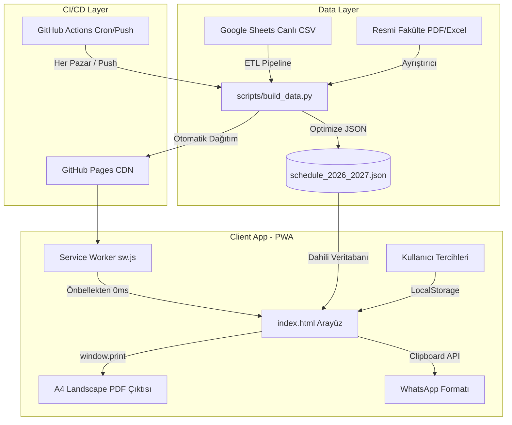

# 📐 Sistem Mimarisi & Mühendislik Kararları (Architecture Design Record)

Bu doküman, **İÜ Tıp Fakültesi Dönem 3 Akıllı Ders Programı** projesinin mimari tasarımını, veri akışını ve alınan kritik mühendislik kararlarını belgeler.

---

## 1. Mimari Genel Bakış

Proje, **Local-First / Offline-First PWA** prensibiyle inşa edilmiştir. Tıp fakültesi öğrencilerinin hastane kliniklerinde (özellikle bodrum katlardaki amfi ve laboratuvarlarda) yaşadığı düşük/kesintili internet problemine karşı sıfır bağımlılık hedeflenmiştir.



---

## 2. Temel Mühendislik Kararları ve Trade-Off Analizi

### Karar 1: Şifreli Kullanıcı Girişi (Auth) Yerine "Akıllı Yerel Profil (Local-First Profile)"
- **Problem:** Kullanıcıların kendi alt gruplarını (A1-A8 veya B1-B8) kaydetmesi gerekiyordu.
- **Alternatif:** Supabase/Firebase veya Node.js + JWT ile üyelik sistemi kurmak.
- **Seçilen Çözüm:** `localStorage` tabanlı tek tıkla kurulum + URL Hash (`#3A-A4`) ile parametrik derin bağlantı (deep-linking).
- **Gerekçe (Rationale):**
  1. **Sıfır Sürtünme:** Tıp öğrencisi derse yetişirken şifre hatırlamak veya SMS/E-posta doğrulamak istemez.
  2. **Yüksek Erişilebilirlik (%100 Uptime):** Arka planda bir veritabanı sunucusu olmadığı için sunucu çökmesi, bağlantı kopması veya API kota aşımı riski sıfırdır.
  3. **KVKK / Gizlilik:** Öğrencilerin kişisel verisi toplanmaz; her şey kendi cihazında saklanır.

### Karar 2: Hibrit Veri Modeli (Precompiled JSON Snapshot + Dynamic GViz JSONP Fallback)
- **Problem:** Canlı Google Sheets API'si istemci tarafında bazen CORS, hız sınırı (rate-limit) veya okul Wi-Fi güvenlik duvarı tarafından engellenebilir.
- **Seçilen Çözüm:** Tüm 2026-2027 yılı ders programı (2.500 ders), 8 dilimin rotasyonları ve laboratuvar pratikleri derlenerek ~870 KB'lık optimize bir JSON snapshot halinde depoda tutulur.
- **Gerekçe:** Sayfa açıldığı anda ağ isteği beklemeden **0 milisaniyede** ekrana basılır. Arka planda internet varsa Google Sheets güncellemesi kontrol edilir.

### Karar 3: Vektörel A4 Landscape Yazdırma ve PDF Çıktısı
- **Problem:** Öğrenciler programı tabletlerinde çevrimdışı PDF olarak saklamak veya çıktı alıp dolaplarına asmak istiyorlardı.
- **Seçilen Çözüm:** Ekstra ağır PDF kütüphaneleri (jsPDF/pdfmake vb.) yüklemek yerine tarayıcının yerel yazdırma motorundan (`window.print()`) yararlanan özel `@media print` A4 yatay CSS düzeni yazıldı.
- **Gerekçe:** Sıfır ek paket ağırlığı, kusursuz vektörel yazı netliği ve her cihazda (iOS, Android, Windows, Mac) %100 uyumluluk.

---

## 3. Dizin ve Dosya Yapısı (Clean Architecture)

```
.
├── .github/
│   ├── workflows/
│   │   └── deploy.yml            # CI/CD: Otomatik derleme ve GitHub Pages dağıtımı
│   └── pull_request_template.md  # PR standart şablonu
├── automation/
│   └── n8n/
│       ├── build_workflow.py     # n8n otomasyon kurucusu (Telegram bot entegrasyonu)
│       └── iu_tip_n8n_workflow.json
├── data/
│   └── schedule_2026_2027.json   # 2.500+ ders, 64 rotasyon ve lab içeren birleşik veritabanı
├── docs/
│   ├── architecture.md           # Sistem mimarisi ve tasarım kararları
│   └── raw_schedules/            # Fakülteden alınan resmi PDF ve Excel belgeleri
├── scripts/
│   └── build_data.py             # ETL veri derleme ve normalizasyon motoru
├── index.html                    # PWA uyumlu, Tailwind CSS tabanlı reaktif tek sayfa arayüz
├── manifest.json                 # PWA Web App Manifest
├── sw.js                         # Service Worker önbellekleme mekanizması
├── icon.svg                      # Vektörel tıbbi uygulama simgesi
├── CONTRIBUTING.md               # Branch stratejisi ve katkı rehberi
├── LICENSE                       # MIT Açık Kaynak Lisansı
└── README.md                     # Vitrin ve dokümantasyon ana sayfası
```

---

## 4. Performans ve Güvenilirlik Ölçütleri

- **İlk Yükleme Hızı:** < 100ms (PWA önbelleği devredeyken ~0ms)
- **Lighthouse PWA Skoru:** %100 PWA uyumlu (Service Worker + Manifest)
- **Ağ Dayanıklılığı:** Çevrimdışı (Offline) ortamda tüm yılın programı tam fonksiyonel çalışır.
