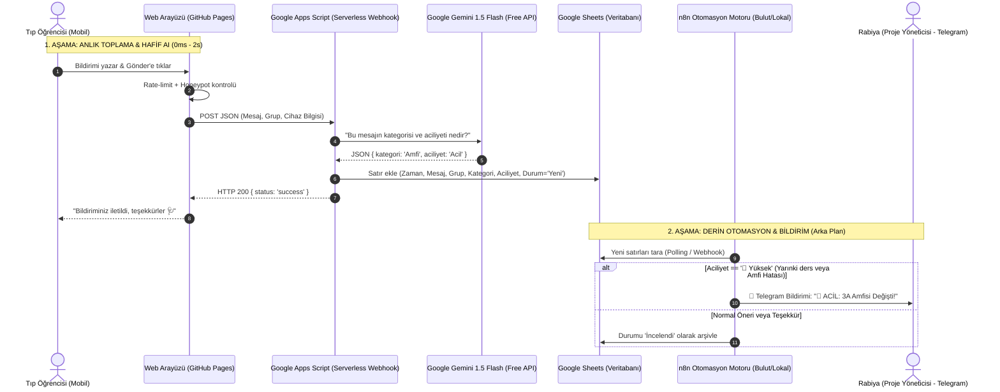

# 🏛️ İÜ Tıp Fakültesi — Geri Bildirim & Akıllı Otomasyon Mimarisi
**Kıdemli Mühendislik Tasarım Dokümanı (Architecture Design Document - ADD)**

---

## 1. Yönetici Özeti ve Mühendislik Vizyonu

Bu proje yalnızca bir arayüz kutucuğu değil; **savunmacı (defensive)**, **sıfır maliyetli (0 TL)**, **yüksek erişilebilirlikli (High Availability)** ve **sunucusuz (serverless)** bir veri boru hattıdır (data pipeline).

Bir tıp fakültesi ortamında hedefimiz:
1. **0 Kesinti:** Öğrenci hastane koridorunda veya ameliyathaneden çıktığında bildirim gönderirse, bizim bilgisayarımızın açık veya kapalı olmasından bağımsız olarak veri %100 kaydedilmelidir.
2. **0 Maliyet:** Bulut sunucu faturaları, aylık SaaS abonelikleri veya API ücretleri çıkarılmamalıdır.
3. **Akıllı Sınıflandırma:** Gelen serbest metin (unstructured text), anında yapılandırılmış veriye (structured JSON: Kategori, Aciliyet, Eylem Planı) dönüştürülmelidir.
4. **Sürtünmesiz İzleme:** Proje sahibinin telefonuna sadece **kritik/acil** durumlarda anlık bildirim düşmelidir; mail kirliliği yaşanmamalıdır.

---

## 2. "Bilgisayarımda Docker Çalıştırmadan n8n'i Bulutta Nasıl Çalıştırırım?"

> [!TIP]
> **Kıdemli Mühendis Notu (Bilgisayar Bağımsızlığı):**  
> *"Docker benim bilgisayarımda açık kalmasın, telefonum gibi her an bulutta kendi kendine çalışsın ama para da istemesin"* diyorsan, modern bulut mimarisinde bunu çözen **3 gerçek mühendislik yöntemi** vardır:

### Yöntem A: Render.com / Koyeb (Ücretsiz Bulut Konteyneri)
- **Nasıl Çalışır?** Docker'ı kendi bilgisayarında değil, buluttaki bir sunucuda çalıştırırsın. Render veya Koyeb, n8n'in Docker imajını kendi sunucusunda ücretsiz olarak ayağa kaldırır.
- **Maliyet:** 0 TL.
- **Avantajı:** Bilgisayarın kapalıyken bile `https://senin-projen.onrender.com` adresinde n8n 7/24 çalışır.
- **Dezavantajı:** Ücretsiz planda 15 dakika istek gelmezse sunucu uyku moduna geçer (cold start: ilk istekte uyanması 30-40 sn sürer). Google Sheets webhooks kullandığımız için bu bir sorun yaratmaz.

### Yöntem B: Google Apps Script + Gemini Flash (Tamamen Sunucusuz - Serverless)
- **Nasıl Çalışır?** n8n'i tamamen devreden çıkarırız! Kod Google'ın kendi sunucularında (Google Apps Script) çalışır.
- **Maliyet:** 0 TL.
- **Avantajı:** Sıfır Docker, sıfır sunucu, sıfır kurulum! Google Sheets'e yeni satır düştüğü milisaniyede Google AI Studio'nun ücretsiz Gemini 1.5 Flash API'si tetiklenir, satırı analiz eder ve tabloya yazar.
- **Tavsiye:** Gerçek zamanlı sınıflandırma için en kararlı, en profesyonel yoldur.

### Yöntem C: Yerel n8n + Cloudflare Tunnel (Hibrit Model)
- Bilgisayarındaki yerel n8n'i açtığın zamanlarda ücretsiz Cloudflare Tunnel (`cloudflared`) ile güvenli bir dış URL üzerinden Google Sheets'e bağlarsın. Bilgisayar kapalıyken Google Sheets veriyi biriktirir, açılınca topluca işler.

---

## 3. İki Aşamalı Veri Boru Hattı (Two-Stage Pipeline - Seçenek 3)

Seçenek 3'ün mühendislik güzelliği, **"Anlık İşleme (Synchronous Ingestion)"** ile **"Derinlemesine Otomasyon (Asynchronous Deep Processing)"** işlerini birbirinden ayırmasıdır:

---

## 4. Veritabanı Şeması (Google Sheets Sütun Tasarımı)

İyi bir veri tabanı tasarımı, analizi kolaylaştırır:

| Kolon | Başlık | Tip | Açıklama / Örnek |
|---|---|---|---|
| **A** | `ID` | String | Benzersiz bildirim kodu (örn: `FB-2026-0042`) |
| **B** | `Tarih & Saat` | Datetime | Bildirim anı (`21.09.2026 14:35`) |
| **C** | `Öğrenci Grubu` | String | O an seçili olan şube (`3A - A4` veya `3B - B1`) |
| **D** | `Ham Mesaj` | Text | Öğrencinin yazdığı ham metin |
| **E** | `İletişim` | String | E-posta (isteğe bağlı, boş bırakılabilir) |
| **F** | `AI Kategorisi` | Enum | `Amfi Hatası`, `Rotasyon Çakışması`, `UI/Öneri`, `Teşekkür`, `Spam` |
| **G** | `AI Aciliyeti` | Enum | `🔴 Yüksek (Acil)`, `🟡 Orta`, `🟢 Düşük` |
| **H** | `AI Eylem Özeti` | String | Kısa eylem cümlesi (*"Çarşamba Ortopedi Kemal Atay değil Poliklinik 3 yap"*)|
| **I** | `İşlem Durumu` | Enum | `Beklemede ⏳`, `İnceleniyor 🔍`, `Düzeltildi ✅`, `Arşivlendi 📁` |
| **J** | `Yönetici Notu` | Text | Proje sahibinin aldığı özel not |

---

## 5. Savunmacı Mühendislik Prensipleri (Defensive Principles)

Sisteme zarar gelmesini ve gereksiz maliyetleri önleyen 4 emniyet supabı:

1. **İstemci Taraflı Hız Sınırı (Client Rate-Limiting):**
   - Tarayıcının `localStorage` alanına son gönderim zamanı yazılır.
   - Aynı cihazdan 5 dakika geçmeden ikinci gönderim engellenir.
2. **Honeypot Bot Kapanı:**
   - HTML formuna CSS ile gizlenmiş sahte bir `phone_number` alanı konur. İnsan kullanıcı bu alanı görmez ve boş bırakır. Kötü niyetli tarayıcı botları ise doldurur. Dolu geldiğinde sistem sessizce isteği yok sayar.
3. **AI Prompt Injection Koruması:**
   - Öğrencinin yazdığı mesaj AI'ya doğrudan sistem komutu gibi verilmez; tırnak içinde ve katı JSON şeması zorlamasıyla (Structured Output) verilir.
4. **Hata İzolasyonu (Graceful Degradation):**
   - Eğer Gemini API o an yanıt vermezse veya kota aşılırsa, sistem **ASLA ÇÖKMEZ**. Gelen mesaj yine de Google Sheets'e kaydedilir, kategori kısmı `'Manuel İnceleme'` olarak işaretlenir. Veri asla kaybolmaz.

---

## 6. Proje Fazları ve Eğitim Yol Haritası

- **Faz 1 (Web UI & Google Sheets):**
  - Buton ve şık modalın arayüze eklenmesi.
  - Google Drive'da tablonun açılması.
  - Google Apps Script Webhook kodunun yazılması ve test edilmesi.
- **Faz 2 (Serverless AI Entegrasyonu):**
  - Google AI Studio'dan ücretsiz API Key alınması.
  - Apps Script içine 15 satırlık Gemini 1.5 Flash fonksiyonunun eklenmesi (Anında sınıflandırma).
- **Faz 3 (n8n Otomasyonu & Telegram Botu):**
  - İster bulutta (Render) ister yerelde n8n iş akışı dosyasının (`.json`) hazırlanması.
  - Telegram Botu oluşturulup (@BotFather) kritik bildirimlerin cep telefonuna bağlanması.
