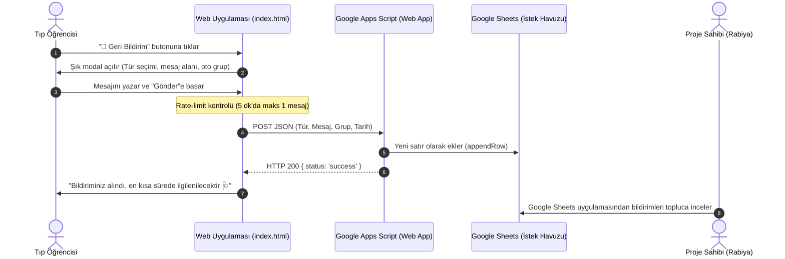

# 📬 Dilek, Şikayet & Geri Bildirim Sistemi Mimarisi

Bu doküman, **İÜ Tıp Fakültesi Dönem 3 Akıllı Ders Programı** için planlanan sunucusuz, sıfır maliyetli ve Google E-Tablolar (Google Sheets) entegreli **Kullanıcı Destek & İstek Havuzu** mimarisini belgeler.

---

## 1. Neden Google Sheets? (Mail Kutusu Endişesi ve Çözüm)

> [!TIP]
> **Kişisel Mail Kirliliğine Kesin Çözüm:**  
> Kullanıcı bildirimlerinin doğrudan kişisel e-posta kutunuza düşmesi; yüzlerce öğrencinin aktif kullandığı bir sistemde mail kutunuzu doldurabilir, önemli kişisel maillerinizi alta itebilir ve bildirim yorgunluğuna yol açabilir.

### Google Sheets Tercihinin Sağladığı Avantajlar:
1. **Sıfır Mail Trafiği:** Kişisel mail kutunuza tek bir bildirim düşmez, gelen kutunuz tertemiz kalır.
2. **Telefondan Kolay Takip:** Telefonunuza indireceğiniz Google E-Tablolar (Google Sheets) mobil uygulaması ile istediğiniz an gelen bildirimleri topluca görebilirsiniz.
3. **Görev & Çözüm Takibi (Status Tracking):** Tabloya eklenecek `[Durum]` sütunu ile hangi hatanın çözüldüğünü (`Çözüldü ✅`, `İnceleniyor 🔍`, `Beklemede ⏳`) işaretleyebilir, hiçbir geri bildirimi kaybetmezsiniz.
4. **Sınırsız ve %100 Ücretsiz:** Google'ın resmi altyapısıdır; sunucu masrafı, API kotası veya abonelik gerektirmez.

---

## 2. Sistem Mimarisi & Veri Akışı



---

## 3. Google E-Tablo Veri Şeması (Kolon Yapısı)

Google Drive'da oluşturulacak **`İÜ Tıp D3 — Geri Bildirim Havuzu`** tablosunun kolonları şu şekilde yapılandırılacaktır:

| Kolon | Başlık | Açıklama | Örnek Veri |
|---|---|---|---|
| **A** | `Tarih & Saat` | Bildirimin yapıldığı an | `21.09.2026 01:45` |
| **B** | `Kategori` | Bildirimin türü | `🚨 Amfi/Derslik Hatası` |
| **C** | `Öğrencinin Grubu` | O an seçili aktif şube & grup | `Dönem 3A — Grup A4` |
| **D** | `Mesaj / Açıklama` | Öğrencinin yazdığı detaylı bildirim | `Çarşamba 11:10 Ortopedi dersliği Kemal Atay değil poliklinik 3 oldu.` |
| **E** | `İletişim (Opsiyonel)` | Geri dönüş istenirse e-posta / telefon | `ogrenci@ogr.iu.edu.tr` *(veya Boş)* |
| **F** | `İnceleme Durumu` | Proje sahibinin işaretleyeceği durum | `Çözüldü ✅` *(Açılır Liste)* |
| **G** | `Notlar` | Kendi kendinize alacağınız kısa not | `Derslik poliklinik olarak güncellendi.` |

---

## 4. Kullanıcı Arayüzü (UI / UX Tasarımı)

### 1. Tetikleyici Buton (Header / Gezinme Çubuğu)
Üst gezinme çubuğunda (Header) yer alan hızlı aksiyon butonlarının yanına göz yormayan, zarif bir buton eklenir:
* **Masaüstü:** `[💬 Geri Bildirim]`
* **Mobil:** `[💬]` ikonu (Tooltipli ve dokunmatik optimize)

### 2. Geri Bildirim Modalı (`#modalFeedback`)
Tıklandığında açılan minimalist pencere:

```
┌────────────────────────────────────────────────────────┐
│  📬 İstek, Öneri & Hata Bildirimi                  ✕   │
│  Fakülte programında değişen bir amfi, eksik bir ders   │
│  veya sistemle ilgili bir önerin mi var? Bize ilet!    │
│                                                        │
│  1. Bildirim Türü:                                     │
│  [🚨 Amfi/Derslik Değişikliği]  [⏰ Saat Uyuşmazlığı]  │
│  [💡 Yeni Özellik / Öneri]      [🐛 Sistem Hatası]     │
│  [💬 Diğer]                                            │
│                                                        │
│  2. Mesajın:*                                          │
│  ┌──────────────────────────────────────────────────┐  │
│  │ Örn: Çarşamba 13:30 Genel Cerrahi dersi...      │  │
│  └──────────────────────────────────────────────────┘  │
│                                                        │
│  3. İletişim (İsteğe Bağlı):                           │
│  ┌──────────────────────────────────────────────────┐  │
│  │ Geri dönüş yapmamızı istersen e-posta adresin    │  │
│  └──────────────────────────────────────────────────┘  │
│                                                        │
│  ℹ️ Seçili profilin (Dönem 3A — A4) mesaja iliştirilir. │
│                                                        │
│                           [ Kapat ]   [ Gönder 🚀 ]    │
└────────────────────────────────────────────────────────┘
```

### 3. Gönderim Sonrası Başarı Ekranı
Öğrenci "Gönder" butonuna bastığında:
* Buton animasyonlu yükleniyor durumuna geçer (`Gönderiliyor...`).
* Başarılı olunca kutu içinde yeşil başarı kartı belirir:
  > **✅ Bildiriminiz Alındı!**  
  > *Katkınız için teşekkür ederiz. İlettiğiniz amfi/ders bilgisi en kısa sürede incelenerek sisteme yansıtılacaktır.*
* 2.5 saniye sonra modal zarifçe kapanır.

---

## 5. Güvenlik & Spam Önleme (Anti-Abuse)

Öğrencilerin butona üst üste basmasını veya kötü niyetli botları engellemek için 3 katmanlı koruma sağlanır:

1. **İstemci Taraflı Hız Sınırı (Rate Limiting):**
   - Gönderim yapıldıktan sonra tarayıcının `localStorage` alanına zaman damgası kaydedilir.
   - Aynı cihazdan 5 dakika geçmeden ikinci bir mesaj atılması engellenir (*"Yeni bir bildirim göndermek için lütfen 4 dakika bekleyin"* uyarısı çıkar).
2. **Karakter ve Boş Mesaj Doğrulaması:**
   - Mesaj en az 10 karakter, en fazla 1000 karakter olabilir. Boş gönderim yapılamaz.
3. **Görünmez Bot Kapanı (Honeypot):**
   - Ekranda insan gözüyle görünmeyen gizli bir alan yer alır. Botlar tüm form alanlarını doldurma eğiliminde olduğu için bu alanı doldururlarsa istek Google Sheets'e iletilmeden sessizce reddedilir.

---

## 6. Google Apps Script Arka Plan Kodu (Tek Seferlik Kurulum)

Google Drive'da oluşturulacak tablonun içine yapıştırılacak hazır Google Apps Script kodu:

```javascript
/**
 * İÜ Tıp Fakültesi Dönem 3 — Geri Bildirim Webhook Servisi
 */
function doPost(e) {
  try {
    var lock = LockService.getScriptLock();
    lock.waitLock(10000); // Eşzamanlı yazma çakışmalarını önler

    var sheet = SpreadsheetApp.getActiveSpreadsheet().getActiveSheet();
    var data = JSON.parse(e.postData.contents);

    // Spam / Honeypot kontrolü
    if (data.botField) {
      return ContentService.createTextOutput(JSON.stringify({ status: 'ignored' }))
        .setMimeType(ContentService.MimeType.JSON);
    }

    var now = new Date();
    var timeZone = Session.getScriptTimeZone() || "GMT+3";
    var formattedDate = Utilities.formatDate(now, timeZone, "dd.MM.yyyy HH:mm");

    sheet.appendRow([
      formattedDate,
      data.category || 'Belirtilmedi',
      data.groupInfo || 'Belirtilmedi',
      data.message || '',
      data.contact || 'Yok',
      'Beklemede ⏳',
      ''
    ]);

    lock.releaseLock();

    return ContentService.createTextOutput(JSON.stringify({ status: 'success' }))
      .setMimeType(ContentService.MimeType.JSON);

  } catch (error) {
    return ContentService.createTextOutput(JSON.stringify({ status: 'error', message: error.toString() }))
      .setMimeType(ContentService.MimeType.JSON);
  }
}
```

---

## 7. Uygulama Adımları (Roadmap)

1. **Adım 1: Dokümantasyonun Oluşturulması** *(Tamamlandı)*
2. **Adım 2: Yeni Git Dalı Açılması:** `feat/feedback-box-google-sheets`
3. **Adım 3: HTML & UI Entegrasyonu:** Header butonunun ve `#modalFeedback` yapısının eklenmesi
4. **Adım 4: JavaScript Entegrasyonu:** Gönderim, validasyon, rate-limit ve `fetch` çağrısı
5. **Adım 5: Google Drive & Apps Script Kurulumu:** Kullanıcı tarafından boş bir e-tablo açılarak Web App URL'sinin eklenmesi
6. **Adım 6: Test & Main Birleştirmesi**
